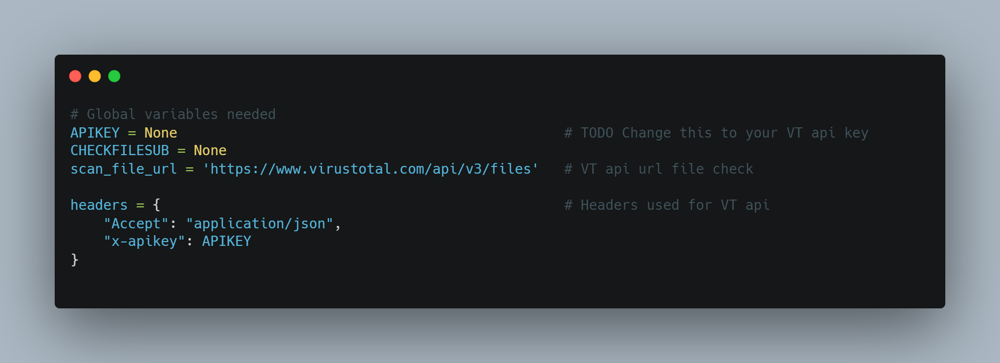

# Malscan
## Malscan is a tool to check threat intel sources, as of right now it only supports VirusTotal. It supports hash checks along with file checks. In future versions O plan to expand its capabilities to support other threat intel sources. 

### Install Instructions
1. Git clone repository
`git clone https://github.com/ReverseThrottle/malscan.git`
2. Move into malscan directory
`cd malscan`
3. Pip install requirements for malscan
`pip install -r requirements.txt`
4. Finally, edit the file and enter your VirusTotal API key

### Future Plans:
- [] Add support for malwarebazaar and malshare
- [] Add support for check URLs, domains, and IPs
- [] Scan multiple file hashes at once
- [] Download sample

